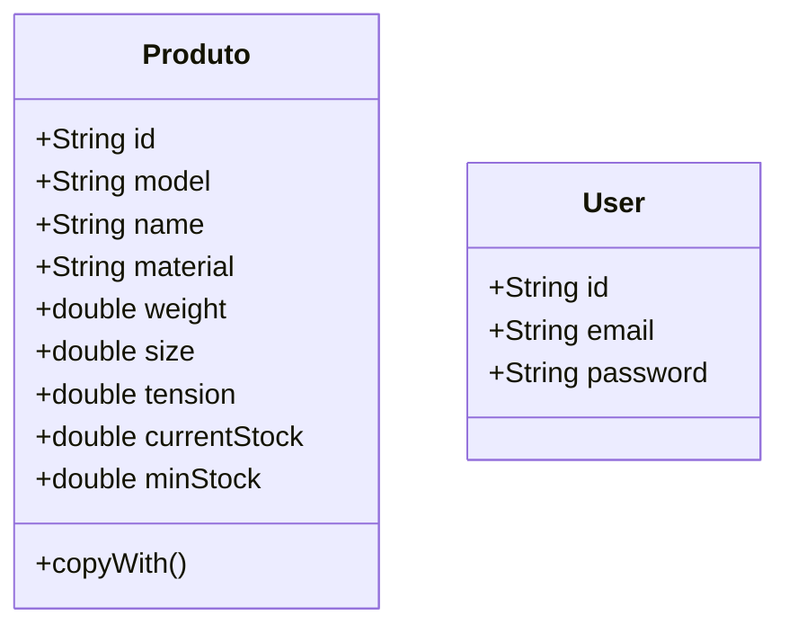

# Sistema de Gestão de Produtos e Estoque

Um sistema completo de gestão de produtos e controle de estoque desenvolvido em Flutter, utilizando Firebase para autenticação e persistência de dados.

## Requisitos Funcionais

### 5. Interface Principal do Sistema
- **5.1.1** - Exibir usuário logado
- **5.1.2** - Logout redirecionando à tela de login
- **5.1.3** - Acesso à interface de "Cadastro de Produto"
- **5.1.4** - Acesso à interface "Gestão de Estoque"

### 6. Interface Cadastro de Produto
- **6.1.1** - Listar produtos cadastrados em tabela
- **6.1.2** - Campo de busca para filtrar produtos
- **6.1.3** - Inserir novos produtos no banco de dados
- **6.1.4** - Editar produtos existentes
- **6.1.5** - Excluir produtos existentes
- **6.1.6** - Validações de dados com alertas
- **6.1.7** - Retorno à interface principal

### 7. Interface Gestão de Estoque
- **7.1.1** - Listar produtos em ordem alfabética (com algoritmo de ordenação)
- **7.1.2** - Seleção de produto para movimentação (entrada/saída)
- **7.1.3** - Inserção da data da movimentação
- **7.1.4** - Verificação automática de estoque mínimo com alertas

## Arquitetura

O projeto segue os princípios da Clean Architecture, com separação clara entre camadas:

### Diagrama de Classes



## Tecnologias Utilizadas

- **Flutter**: Framework para desenvolvimento mobile cross-platform
- **Dart**: Linguagem de programação
- **Firebase Authentication**: Sistema de autenticação de usuários
- **Cloud Firestore**: Banco de dados NoSQL em tempo real
- **Riverpod**: Gerenciamento de estado reativo
- **Material Design**: Design system do Google

## Configuração do Firebase

### 1. Criar Projeto no Firebase Console
1. Acesse [Firebase Console](https://console.firebase.google.com/)
2. Clique em "Criar um projeto" ou "Add project"
3. Defina o nome do projeto (ex: "meu-projeto")

### 2. Configurar Authentication
1. No menu lateral, clique em "Authentication"
2. Vá para a aba "Sign-in method"
3. Ative o provedor "Email/Password"
4. Configure as regras de segurança se necessário

### 3. Configurar Firestore Database
1. No menu lateral, clique em "Firestore Database"
2. Clique em "Criar banco de dados"
3. Selecione uma localização para o banco de dados
4. Escolha "Iniciar no modo de teste"

### 4. Configurar App Flutter
1. No Firebase Console, clique no ícone do Android (</>) para adicionar um app
2. Registre o app com o package name: `com.example.sistema`
3. Baixe a CLI do firebase e flutterfire e rode:

```bash
flutterfire configure
``` 

### 5. Instalar Dependências
```bash
flutter pub get
```

### 6. Executar o Projeto
```bash
flutter run
```

## Como Usar

1. **Login**: Use suas credenciais do Firebase Auth para fazer login
2. **Home**: Tela principal com navegação para as funcionalidades
3. **Cadastro de Produtos**:
   - Visualize a lista de produtos
   - Use a busca para filtrar produtos
   - Adicione novos produtos preenchendo o formulário
   - Edite produtos existentes clicando neles na lista
   - Exclua produtos com o botão de deletar
4. **Gestão de Estoque**:
   - Visualize produtos em ordem alfabética
   - Selecione um produto para movimentação
   - Escolha entre entrada ou saída de estoque
   - Insira a data e quantidade da movimentação
   - Receba alertas quando o estoque estiver abaixo do mínimo

## Estrutura do Projeto

```
lib/
├── core/
│   └── riverpod/
│       └── riverpod.dart          # Provedores Riverpod
├── features/
│   ├── auth/                      # Módulo de autenticação
│   │   ├── data/
│   │   │   ├── datasource/
│   │   │   └── repository/
│   │   ├── domain/
│   │   │   ├── repository/
│   │   │   └── usecases/
│   │   └── presentation/
│   │       ├── screens/
│   │       ├── state/
│   │       └── widgets/
│   └── products/                  # Módulo de produtos
│       ├── data/
│       │   ├── datasource/
│       │   ├── model/
│       │   └── repository/
│       ├── domain/
│       │   ├── entity/
│       │   ├── repository/
│       │   └── usecases/
│       └── presentation/
│           ├── screens/
│           ├── state/
│           └── widgets/
├── firebase_options.dart          # Configurações Firebase
└── main.dart                      # Ponto de entrada da aplicação
```

## Segurança

- Autenticação obrigatória para acesso ao sistema
- Validações de entrada de dados
- Controle de permissões baseado no usuário logado
- Dados armazenados de forma segura no Firestore

## Funcionalidades de Estoque

- **Controle de Estoque Mínimo**: Alertas automáticos quando o estoque estiver baixo
- **Movimentações**: Registro de entradas e saídas com data
- **Ordenação Alfabética**: Produtos organizados por nome
- **Validações**: Prevenção de saídas que resultem em estoque negativo
